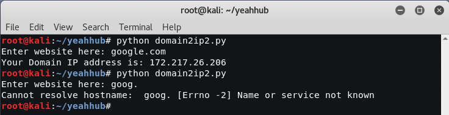
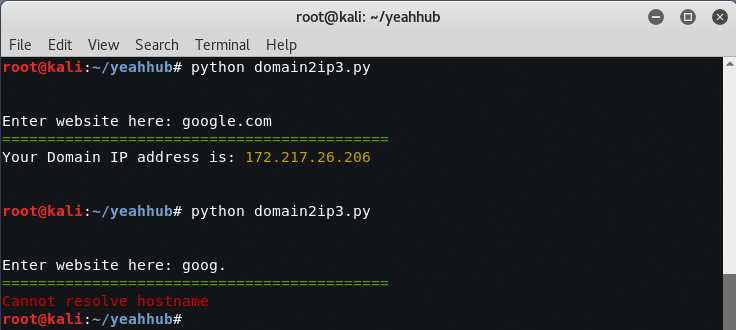
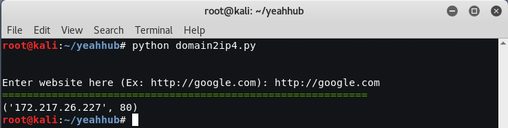
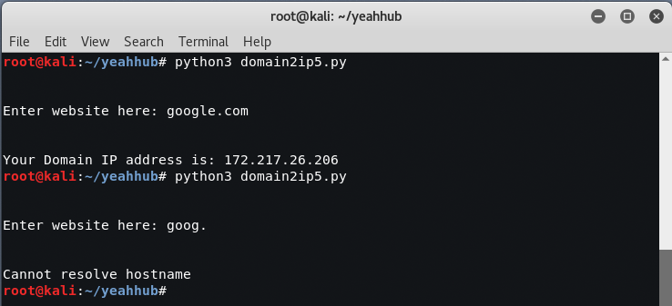

# domain2ip
Find a Website IP with Python2 and Python3

Example 1 – Find Website IP with Python2 (Without any Exception)
Link - https://github.com/yeahhub/domain2ip/blob/master/domain2ip1.py

Example 2 – Find Website IP with Python2 (With Exception)
Link - https://github.com/yeahhub/domain2ip/blob/master/domain2ip2.py

Example 3 – Find Website IP with Python2 (With Socket Method & Colored Module)
Link - https://github.com/yeahhub/domain2ip/blob/master/domain2ip3.py

Example 4 – Find Website IP with Python2 (With Request Method)
Link - https://github.com/yeahhub/domain2ip/blob/master/domain2ip4.py

Example 5 – Find Website IP with Python3 (With Socket Module)
Link - https://github.com/yeahhub/domain2ip/blob/master/domain2ip5.py

